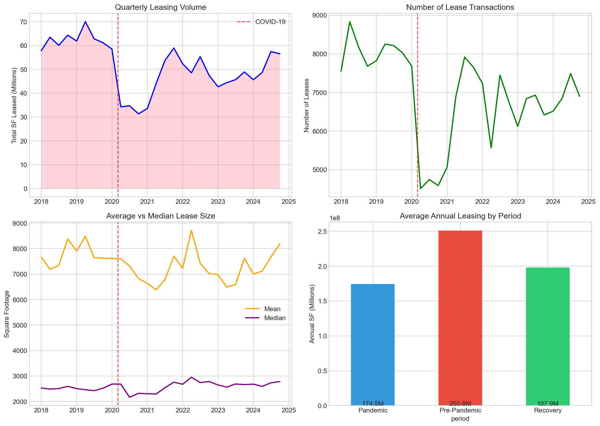
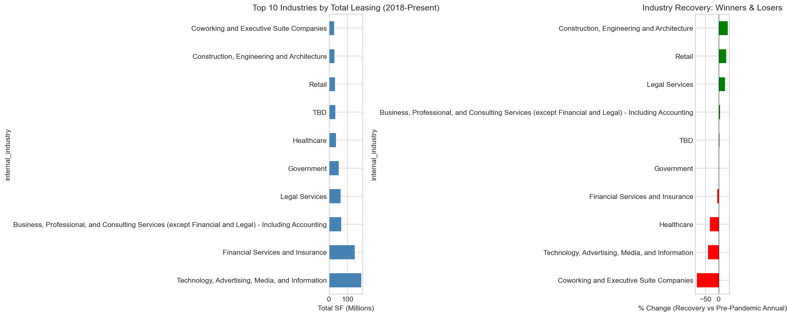
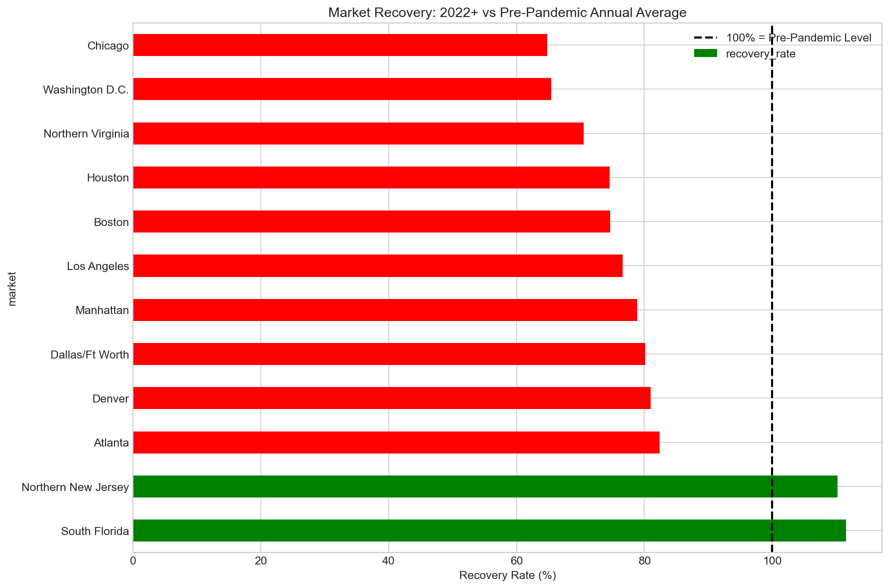

# Commercial Real Estate Market Analysis

A data science project analyzing post-pandemic trends in US commercial real estate leasing, built for **ASA DataFest 2025**.

## Overview

This project analyzes **194,685 lease transactions** from 2018-2024 across 29 US markets to uncover how the COVID-19 pandemic reshaped office leasing patterns. We built interactive tools and visualizations to help Savills advise clients on where, when, and how to locate their offices.

## Key Findings

### Pandemic Impact
- **-30.4%** drop in annual leasing during pandemic (2020-21 vs 2018-19)
- Currently at **79%** of pre-pandemic levels (not fully recovered)

### Industry Winners & Losers

| Winners | Recovery vs Pre-Pandemic | Losers | Recovery vs Pre-Pandemic |
|---------|--------------------------|--------|--------------------------|
| Construction/Engineering | +33.6% | Coworking | -81.6% |
| Retail | +28.6% | Tech/Media | -40.6% |
| Legal Services | +23.3% | Healthcare | -33.8% |

### Geographic Shifts
- **+4.5pp shift to suburban** locations post-pandemic
- **South Florida** (112%) and **Northern NJ** (110%) fully recovered
- Major metros like **Chicago** (65%) and **DC** (65%) still struggling

### Flight to Quality
- Class A share slightly increased (+0.7pp)
- Median lease size increased from 2,504 SF to 2,707 SF

## Visualizations


*Quarterly leasing volume showing COVID-19 impact and recovery*


*Industry winners and losers in the post-pandemic market*


*Recovery rates by market - South Florida and NJ leading*

## Project Structure

```
├── README.md
├── requirements.txt
├── data/
│   ├── raw/                    # Raw data (gitignored - too large)
│   └── processed/              # Enriched datasets for app
├── notebooks/
│   ├── analysis.ipynb          # Original EDA
│   └── datafest_analysis.ipynb # Full DataFest analysis
├── src/
│   ├── data_processing.py      # ETL pipeline
│   ├── visualization.py        # Map generation
│   └── run_analysis.py         # Generate all insights
├── app/
│   └── streamlit_app.py        # Interactive explorer
└── outputs/                    # Generated visualizations
```

## Quick Start

### Install Dependencies
```bash
pip install -r requirements.txt
```

### Run the Analysis
```bash
python src/run_analysis.py
```

### Launch the Interactive App
```bash
cd app
streamlit run streamlit_app.py
```

## Data

**Source**: Savills commercial real estate lease transaction data (provided for ASA DataFest 2025)

- **194,685** lease records
- **29** US markets
- **2018-2024** time range
- Key fields: market, building class, industry, square footage, transaction type, CBD/suburban

*Note: Raw data files are gitignored due to size. Processed data is included for the Streamlit app.*

## Methodology

### Pricing Model
| Factor | Value |
|--------|-------|
| Base Rate | $75.09/SF |
| Class A Premium | +20% |
| Class O Discount | -20% |
| Bulk Discount (>50K SF) | -7% |

### Safety Score
- Based on crime incidents within 500m of each building
- Normalized 0-1 (higher = safer)

### Accessibility Score
- Based on weighted transit route density
- Icons indicate access level: subway > bus > train > bicycle > walking

## Recommendations for Savills Clients

### For Tenants
1. **Leverage tenant-favorable market** - Vacancy remains elevated
2. **Consider Class A properties** - Flight to quality is real
3. **Right-size your space** - Hybrid work means less SF needed

### For Landlords
1. **Invest in amenities** - Better buildings win tenants
2. **Target growth industries** - Legal, Construction, Retail expanding
3. **Be cautious with** - Coworking, Tech (major contraction)

## Technologies

- **Python** - pandas, numpy, matplotlib, seaborn
- **Visualization** - Folium, Streamlit
- **Geospatial** - GeoPy, Folium plugins

## Authors

Built for ASA DataFest 2025

## License

MIT License
